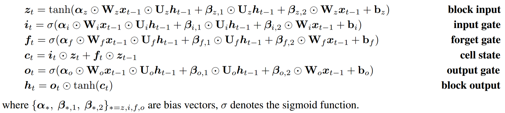
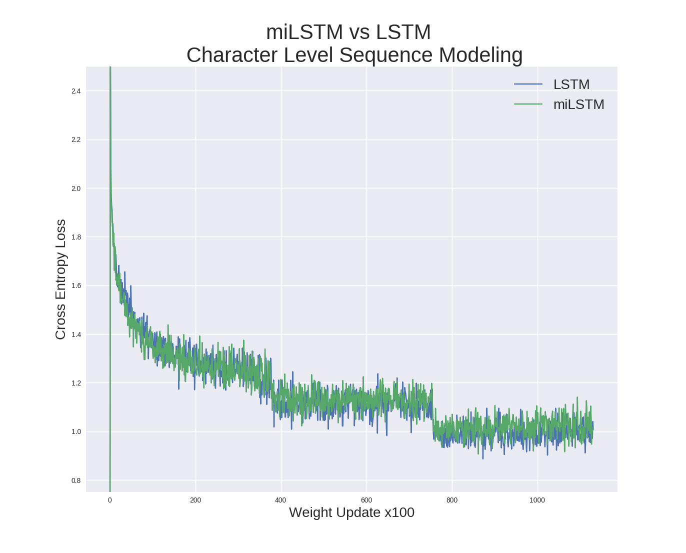

For anyone familiar with Death Metal you know it's a genre known for it's extremes. The music, the names, the subject matter - it's all extreme! I thought it would be interesting to see what a recurrent neural network would come up with asked to generate it's own death metal band names. 

The real reason that I did this was to code up a [LSTM with multiplicative integration](http://papers.nips.cc/paper/6215-on-multiplicative-integration-with-recurrent-neural-networks.pdf) and see how well it did with sequence modeling compared to a vanilla LSTM. 

But first, the fun part! A selection of some of the generated band names below. A word of caution, due to the nature of death metal some readers might find the generated names offensive. 

{: .code}
```
Sadistic Stench

Joyless Homicide 

Enthrallment Suns 

Torment of Torment 

Psychologist 

Old Scorched 

Words of Death 

Suburbia Ghost of Pain

Gore Disease

Fragile Riot

Wormhorn

Utopia Corpse 

Psychic Inc. 

Burn Me Binder

Rest in Death 

Bloodgasm

Jonas of Man 

The Antisocial Ransatary 

Youth Crushing 

Ancient Torment 

Human Terror Through Darkness 

You 

Morbid Defilement 

Parasitical Mandality

Terrorable Life

Zombification

Human Stench 

Gate of Here 

Unknown Grinder

Inverted Brain

Zombie Strength 

Hate Slug

Just Scream 
```

## LSTM with multiplicative intergration in PyTorch

The real reason that I did this other than to be funny is to see how easy it would be to code up this type of LSTM in PyTorch and see how it's performance compared to a vanilla LSTM for sequence modeling. I'm happy to report that coding this in PyTorch was a breeze! However, I didn't really see any improvement over a vanilla LSTM. Most likely this problem wasn't complex enough to really test the capacity of the MI-LSTM.

### Coding the MI-LSTM

In PyTorch we define a forward function that explicitly controls the computation of our network. It specifies the operations that take us from the input tensor to the output tensor, in our case it will be all of the operations that create a MI-LSTM. 

{: .center}

<p style="text-align:center; font-size:75%; font-style: italic;">Appendix A of "On Multiplicative Integration with Recurrent Neural Networks"</p>

To turn these mathematical expressions into a PyTorch model we just have to set up the matricies and specify the computations. The resulting forward function pretty much looks identical to the mathematical notation. 

{: .code}
```python
def forward(self, inp, h_0, c_0):
    # encode the input characters
    inp = self.encoder(inp)
    # forget gate
    f_g = F.sigmoid(self.alpha_f * self.weight_fx(inp) * self.weight_fh(h_0) +
                   (self.beta_f1 * self.weight_fx(inp)) + (self.beta_f2 * self.weight_fh(h_0)))
    # input gate
    i_g = F.sigmoid(self.alpha_i * self.weight_ix(inp) * self.weight_ih(h_0) +
                   (self.beta_i1 * self.weight_ix(inp)) + (self.beta_i2 * self.weight_ih(h_0)))
    # output gate
    o_g = F.sigmoid(self.alpha_o * self.weight_ox(inp) * self.weight_oh(h_0) +
                   (self.beta_o1 * self.weight_ox(inp)) + (self.beta_o2 * self.weight_oh(h_0)))
    # block input
    z_t = F.tanh(self.alpha_z * self.weight_zx(inp) * self.weight_zh(h_0) +
                (self.beta_z1 * self.weight_zx(inp)) + (self.beta_z2 * self.weight_zh(h_0)))
    # current cell state
    cx = f_g * c_0 + i_g * z_t
    # hidden state
    hx = o_g * F.tanh(cx)

    out = self.decoder(hx.view(1,-1))

    return out, hx, cx
```

### MI-LSTM vs LSTM

This quick experiment is based on the [char-rnn](https://karpathy.github.io/2015/05/21/rnn-effectiveness/) from Andrej Karpathy's blog post 'The Unreasonable Effectiveness of Recurrent Neural Networks'. Most of the PyTorch code other than the mi-lstm was borrowed and adapted from the examples and tutorials created by Sean Robertson in his repo ['Practical PyTorch'](https://github.com/spro/practical-pytorch). 

I took the list of death metal band names from the kaggle [dataset](https://www.kaggle.com/zhangjuefei/death-metal). Then trained a MI-LSTM and LSTM with 1024 hidden units on the corpus ofband names. The network was trained with [Adam](https://arxiv.org/abs/1412.6980) with an initial learning rate of 0.0005 for 3 epochs. The learning rate was scaled down by 75% at the start of epoch 2 and 3. 

{: .center}

<p style="text-align:center; font-size:75%; font-style: italic;">Training loss curves for LSTM and MI-LSTM.</p>

Both LSTM styles convereged to similar loss values. This task may have been too simple to test the benefits of MI-LSTM.

Code [here](https://github.com/FlorianMuellerklein/death_metal_lstm)

### References

* Yuhuai Wu, Saizheng Zhang, Ying Zhang, Yoshua Bengio, Ruslan Salakhutdinov "On Multiplicative Integration with Recurrent Neural Networks", [link](http://papers.nips.cc/paper/6215-on-multiplicative-integration-with-recurrent-neural-networks.pdf)
* Andrej Karpathy, "The Unreasonable Effectiveness of Recurrent Neural Networks", [link](https://karpathy.github.io/2015/05/21/rnn-effectiveness/)
* Diederik Kingma, Jimmy Ba, "Adam: A Method for Stochastic Optimization", [link](https://arxiv.org/abs/1412.6980)
* Sean Robertson, "Practical PyTorch", [link](https://github.com/spro/practical-pytorch)

