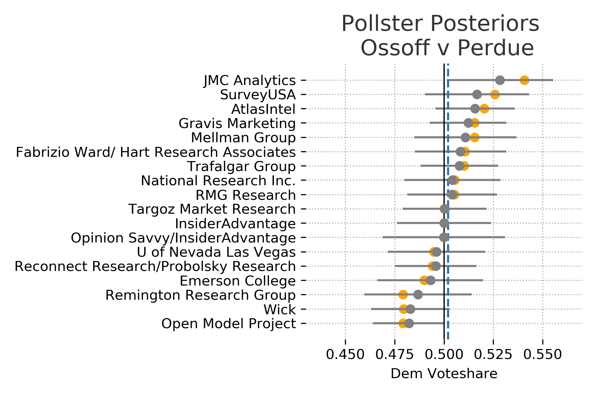
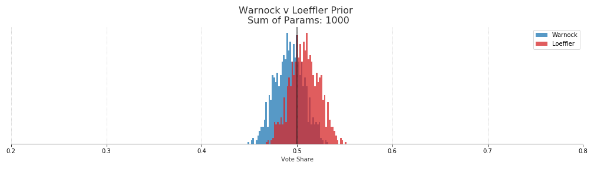

Updated: Dec 19, 2020

# Warnock: 45.2% - Loeffler: 54.8%

{: .center}

# Ossoff: 42.1% - Perdue: 57.9%

{: .center}

This is a good time to point out that a win probability of around 60% can be misleading. At least in my case I take that too confidently. Looking at the amount of overlap between the two distributions makes both races appear much more like a coin toss.

## Methods

The probabilities were derived from a hierarchical partial pooling model of voteshares using [PyMC3](https://docs.pymc.io/). The hierarchical model assumes that there is some latent (unobservable) true vote share for each candidate. We can get glimpses of that vote share with the polls, however each pollster will have its own distribution of estimated vote share due to sampling error, house effects or other some other error. Therefore we model the results of each pollster as some offset from the true unobservable vote share. 

Assume that the number of voters for each candidate in a survey follows the Binomial distribution. 

{: .center}

Each pollster then has a probability of success for a given candidate which is modeled by a beta distribution where the parameters are given by the estimated state vote share modulated by some pollster offset. 

{: .center}

The offset for each pollster is given by taking the exponential of the half normal distribution. These will roughly correspond to the numbers of successes and failures for the candidates in the polls. We know this value can not be negative which is why half normal is used. An exponential distribution could also work here. 

{: .center}

Finally, the thing that we actually care about. The latent vote share of Georgia voters. This is modeled by a beta distribution and initialized by the results of the November election. 

{: .center}

Essentially what is happening here is that we are estimating distributions for each pollster about what results we should expect from them. Assuming that those pollster distributions are influence by the actual state distribution as well as some pollster specific offset. Finally, the actual state vote share distribution is driven by the prior and each of the polls.

An alternative to the partial-pooling model would be a complete pooling model. In this case we would try to predict the same parameter for vote share for all of the pollsters. This parameter would then be the expected state wide vote share.  As each pollster is trying to measure the same population there is some validity to that approach. However, I think its more realistic to allow each pollster to vary but have them anchored to some population distribution (which is what partial-pooling does). 

## Win Probabilities

After estimating the distribution of vote share for each candidate we get the probability of victory by the proportion of estimated voteshare that is greater than each candidates opponent. 

## Priors

The priors for each model are set by the vote shares from the November election. 

However some decisions had to be made for the Warnock-Loeffler prior because there were other Democrats and Republicans on the ballot for that race. Therefore the total Democrat and Republican voteshares were used rather than just the normalized voteshares for Warnock and Loeffler. We assume that republican voters that come back for the runoff race are likely to vote for Loeffler if their preferred republican candidate is no longer on the ballot. Using the normalized ratio between only Warnock and Loeffler would result in Warnock having an advantage in the posterior (roughly 60%). 

## Pollster Effects

Interestingly, if we plot each of the learned pollster distributions the model tends to push the median voteshare slightly towards the Republicans when compared with the actual poll results. However each of the actual results are still well within the expected ranges of each pollsters distribution. This is likely due to the polls generally favoring the Democrats while the past election results favored the Republicans. 

Plot the actual polls results in orange and the estimated poll distribution in gray. If we don't see any orange is because the estimated median completely overlaps the actual results. 

{: .center}

{: .center}

## Tuning Prior

By using the beta distribution as our prior we can tune how much of an impact it has on the posterior distribution. A simple way of doing this is to use the sum of the two parameters for the beta distribution, alpha and beta. The larger the sum the more "peaky" or informative the prior, which gives it more weight in the final distribution. In other words, the more sure we are that the outcome of the Nov 2020 election will repeat in the runoff the more weight we want to put into the prior. 

There are good reasons to weight the prior highly here. The election was recent, the turnout is much larger than any poll sample size, and it was an actual election not a survey. 

However, turnout in the runoff could be much different and public opinion can change. 

In the end a sum of parameters equaling 50 was used, which gives us a prior with swings in vote share of about +-1 15% from the Nov 2020 outcome. This uncertainty is quite large but it allows the polls to drive most of the posterior. With a sum of parameters at 1000 the priors are much tighter and quite a bit more resistant to change along with the polling data. 

{: .center}

{: .center}

In terms of probabilities of election outcomes, if we use the sum of paramters of 1000 prior we get a roughly 70% win probability for both republican candidates. That would essentially be saying that the results of the November election will be repeated and we shouldn't put too much weight on the polls. 

How much weight to put on this prior is certainly up to debate and people more versed in Georgia politics can have that debate. Ideally I would have consulted with someone more versed Georgia politics for this decision. 

[Data 538](https://projects.fivethirtyeight.com/georgia-senate-polls/) [Code](https://github.com/FlorianMuellerklein/GeorgiaRunoffHeirachicalPartialPooling)