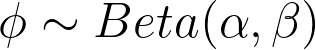

After all of the post motem conversations about election forecast we once again hear a lot about how off the polls were. We also see discussions between forecasters about whether their inputs were correct or their models contained enough uncertainty. So the goal here was to create a simple election forecasting system by only using polling data, historical election results, and incorporating sufficient uncertainty based on historical polling error. The resulting model is one that is a bit more conservative than most of the current election forecasting models.

The results are quite interesting. The model does well even though it is extremely simple, makes very few assumptions, only uses state level polling, doesn't use any fundamentals, and no state correlations are modeled. 

## Why Uncertainty?

Maybe to some it will seem like a cop-out but I believe that its the correct assumption for the domain, human behavior. 

## Results

All results use all of the polling data up until Nov 2 on each election year. 

#### Democrat Win Probability 
| Year | 538 | Princeton | Economist | Mine | 
| ------|:------:|:----------:|:----------:| :----------:|
| 2020 | 89%   | NA  | 97%  | 84.4% |
| 2016 | 71.4  | 93% |      | 73.9% |
| 2012 | 90.9% | NA  |      | 78.0%* |

#### Democrat Mean Electoral College Prediction 
| Year | 538 | Princeton | Economist | Mine | Result |
| ------|:------:|:----------:|:----------:|:----------:|:----------:|
| 2020 | 348   | 342 | 356 | 306.4 | 306 |
| 2016 | 302.2 | 323 |     | 292.8 | 232 |
| 2012 | 332   | 303 |     |  296 | 332* |

Polls from 2012 are from [wikipedia](https://en.wikipedia.org/wiki/Statewide_opinion_polling_for_the_2012_United_States_presidential_election). There are significantly less polls there than in the other two datasets, 668 polls in 2012 vs 6020 for 2020. If anyone has a bigger dataset for 2012 let me know! I imagine that this method would be more in line with the others with a proper polling datset. 

## My Assumptions

I am by no means a polling or political expert, not by a long shot. So I tried to keep my assumptions low to avoid injecting my own biases into the model. Instead my goal is to include enough uncertainty in the model that the outputs are reasonable when backtesting against known election outcomes. 

1. **Polls** No poll corrections/adjustments. I am no expert in polling so it would be detrimental for me to introduce my own biases into that data. Polling is hard work and the majority of pollsters are working really hard to provide accurate numbers. It seems like compounding my own corrections onto theirs could lead to problems.    I have a hunch that even bad polls could be useful in modern times. There could be market forces that award biased polls and the proportions of those biased polls could reflect the proportion of the population that has those biases.   

2. **Temporal Effects** Polls closer to the election date should be relied on more heavily. 

3. **Priors** Use data from the past 5 elections to develop priors for each state. Margin prior gets weaker as we get closer to the election. 

## Methods

In short the model is quite simple. Forecasted state win margins are produced by hierarchical models that use past election results to develop priors and polling data to produce the posteriors. Uncertainty is baked in by using fat tail distributions and historical polling error. 

### State Level

State level model assumes that the true vote margin is distributed by a Student T distribution. We start from a weighted average of the previous 5 elections, giving more weight to more recent elections. Then allow the data to produce the forecasted distribution of margins. However we can not know the true vote margin and there are probably more reasons why then we can list. For example, are the same subset of Florida residents voting in each election, are some voters changing their preferred party between elections, or did some crazy event happen that made someone change their mind last minute?

We assume that our window is through the polling data. But that comes with its own issues and I try to handle those through the fat tailed distributions. Additionally, I assume (correctly or incorrectly) that polling errors are distributed around 0 with an average swing of about 4% (from historical [538 analysis](https://fivethirtyeight.com/features/the-polls-are-all-right/)). 

So the state model looks like the following. Where *d* represents the distribution of vote margins. Then assume that the sample mean (polling data) is given by the actual margins. We then want the distribution of polling to capture the randomness of sampling, public opinion, life events interferring with pollsters, distrust of polling institutions, distrust of establishments, lies to pollsters, you name it, and finally adds in historical polling error explicitly.  

### Electoral College

The electoral college winners are estimated by Monte Carlo simulation. Taking the estimated win probabilities from the state models and using those for thousands of independent coin flips per state. Proportion of electoral votes in the simulations above 270 give us the probability of the winner. The simulation also provides the average estimated electoral college votes. 

### Why Student T?

Take Florida over the past 5 elections (2000 - 2016)for example. If we average the popular vote margins over those elections we get roughly 0.12% (toward dems) and with an average swing of 2.4%. This year in 2020 Trump won Florida by a margin of about 3.3%. A normal distribution using these parameters would give us a probability of 7% of that or a greater margin happening. Whereas a Student T distribution gives us a probability of 19.5%. It seems like we would want to allow for such a swing in our models.

### 2020 Map

### 2016 Map

### 2012 Map

## References

### Bayesian and Sim Methods
[Predicting the Next US President by Simulating the Electoral College](https://scholarship.claremont.edu/jhm/vol8/iss1/5/)

[Bayesian Coin Flips](https://www.thomasjpfan.com/2015/09/bayesian-coin-flips/)

[Introduction to Data Science: Data Analysis and Predicton Algorithms with R](https://rafalab.github.io/dsbook/models.html#election-forecasting) Describes a useful hierarchical bayesian model that incorporates historical data and poll aggregations. 

### StudentT
[Robust Statistical Modeling Using the t Distribution](https://escholarship.org/content/qt27s1d3h7/qt27s1d3h7.pdf)"If *v* (degrees of freedom in studentT) is fixed a prior at some reasonable value, it is a robustness tuning parameter." In other words we can use it as a hyperparameter that we control to decide how robust we want our model to be against extreme values. Here the parameter was tuned through back-testing on past elections. 

[What is the probability that your vote will make a difference?](https://www.nber.org/system/files/working_papers/w15220/w15220.pdf)"The t distribution with 4 degrees of freedom is commonly used as a robust alternative to the normal (Lange, Little, and Taylor, 1989); we use it here to allow for the possibility of unanticipated shocks. Using the t instead of the normal has little effect on the probability of a decisive vote in close states, but it moderates the results in states farther from the national median , for example changing the estimated probability of decisiveness in the District of Columbia from 5e-85 to 2e-12, in Utah from 9e-16 to 2e-10, but changing the estimate in Ohio only from 3.4e-8 to 3.1e-8."

### Cauchy Dist (T dist with degrees of freedom = 1)
[Why heavy tails](http://swer.wtamu.edu/sites/default/files/Data/swer%2014%20Harris.pdf)
"The Cauchy distribution, just like the Gaussian distribution, is a stable distribution, but one with fat tails. Over the years several academic papers have looked into it as an alternative to best describe these extreme volatility events." 

[Stock option pricing inference](https://thomasvilhena.com/2019/12/stock-option-pricing-inference)
"Heavy-tailed distributions, like Cauchy, are better models for financial returns because the normal model does not capture the large fluctuations seen in real assets." 

[Goodness-of-fit testing for the Cauchy distribution with application to financial modeling](https://www.sciencedirect.com/science/article/pii/S1018364718313193)

### Machine Learning and Sims
[Forecasting the 2020 US Elections with Decision Desk HQ: Methodology for Modern American Electoral Dynamics](https://hdsr.mitpress.mit.edu/pub/gach7e59/release/1)