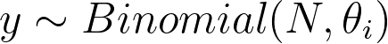
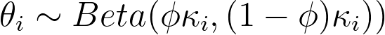
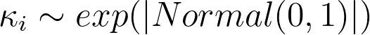
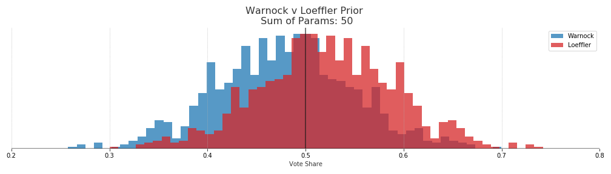

# Warnock: 45.2% - Loeffler: 54.8%

{: .center}

# Ossoff: 42.1% - Perdue: 57.9%

{: .center}

## Methods

The probabilities were derived from a hierarchical partial pooling model of voteshares using [PyMC3](https://docs.pymc.io/). The hierarchical model assumes that there is some latent (unobservable) true voteshare for each candidate. We can get glimpses of that voteshare with the polls, however each pollster will have its own distribution of estimated voteshare due to sampling error, house effects or other some other error. Therefore we model the results of each pollster as some offset from the true unobservable vote share. 

Assume that the number of voters for each candidate in a survey follows the Binomial distribution. 

{: .center}

Each pollster then has a probability of success for a given candidate which is modeled by a beta distribution where the parameters are the latent estimated state voteshare modulated by some pollster offset. 

{: .center}

The offset for each pollster is given by a half normal distribution. These will roughly correspond to the numbers of successes and failures for the candidates in the polls. We know this value can not be negative which is why half normal is used. An exponential distribution could also work here. 

{: .center}

Finally, the thing that we actually care about. The latent vote share of Georgia voters. This is modeled by a beta distribution and initialized by the results of the November election. 

{: .center}
< img src="../images/prior.gif" height="100">

Essentially what is happening here is that we are estimating distributions for each pollster about what results we should expect from them. Assuming that those pollster distributions are influence by the actual state distribution as well as some pollster specific offset. Finally, the actual state distribution is driven by past events as well as the results from each of the polls.

## Priors

The priors for each model are set by the vote shares from the November election. However some decisions had to be made for the Warnock-Loeffler prior because there were other Democrats and Republicans on the ballot for that race. Therefore the total Democrat and Republican voteshares were used rather than just the normalized voteshares for Warnock and Loeffler. Because we assume that republican voters that come back for the runoff race are likely to vote for Loeffler if their preferred republican candidate is no longer on the ballot. 

## Pollster Effects

Interestingly, if we plot each of the learned pollster distributions the model tends to push the median voteshare slightly towards the Republicans when compared with the actual poll results. However each of the actual results are still well within the expected ranges of each pollsters distribution. This is likely due to the polls generally favoring the Democrats while the past election results favored the Republicans. 

Plot the actual polls results in orange and the estimated poll distribution in gray. 

{: .center}

{: .center}

## Tuning Prior

By using the beta distribution as our prior we can tune how much of an impact it has on the posterior distribution. A simple way of doing this is to use the sum of the two parameters for the beta distribution, alpha and beta. The larger the sum the more "peaky" or information the prior distribution, which gives it more weight in the final distribution. In other words, the more sure we are the outcome of the Nov 2020 election will repeat in the runoff the more weight we want to weight teh prior more, or set the sum of parameters higher. 

There are good reasons to weight the prior highly here. The election was recent, the turnout is much larger than any poll sample size, and it was an actual election not a survey. 

However, runoff turnout could be much different and things can change in public opinion. The Perdue-Ossoff results had the two candidates pitted against each other but the Warnock-Loeffler race also had other Republican and Democratic nominees. 

In the end a sum of parameters equaling 50 was used, which allows for swings in voteshare of about +-1 20%. This uncertainty is quite large but it allows the polls to drive most of the posterior.  

{: .center}

{: .center}

In terms of probabilities of election outcomes, if we use the sum of paramters of 1000 prior we get a roughly 70% win probability for republican politicians. However this is because we would essentially be saying that the results of the November election will be repeated and we shouldn't put too much weight on the polls. Whether or not this is a good assumption is certainly up to debate and people more versed in Georgia politics can have that debate. 

[Data 538](https://projects.fivethirtyeight.com/georgia-senate-polls/)