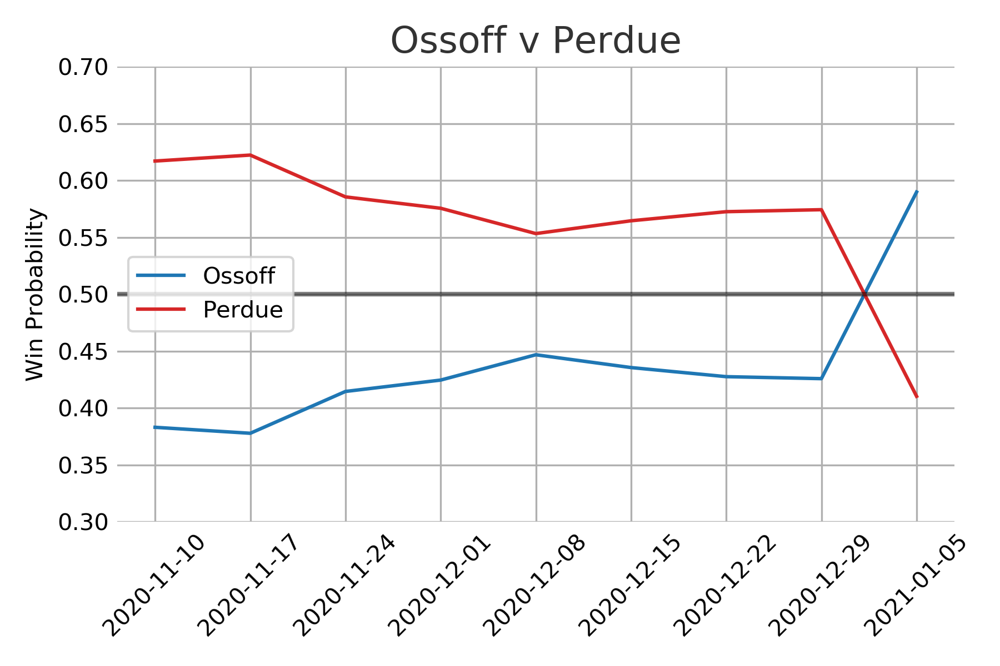

Now that the election has ended its worth evaluating how well the model did. We are interested in both the final predictions after all polls were collected and how the model changed as new data came in. 

## Final Voteshare Prediction and Results

| Candidate | Result | Mean | 80% Interval |
| ----------|--------|------|--------------|
| Ossoff    |  50.6  | 50.2 | 49.0 - 51.5  |
| Perdue    |  49.4  | 49.8 | 48.5 - 51.0  |
| Warnock   |  51.0  | 50.5 | 49.2 - 51.7  |
| Loeffler  |  49.0  | 49.5 | 48.3 - 50.8  |

The actual election results are squarely within the expected intervals with the mean prediction for Warnock-Loeffler off by 0.5% and for Ossoff-Perdue off by 0.4%. I am happy with this outcome but really this is a testament to the quality of the polling data. 

## Temporal Behavior

I am kicking myself for not including trend lines since the Democratic win probabilities experienced a big rally in the last week. Towards the end of the race almost all of the polls showed an advantage for the two Democratic candidates. With that amount of consistency across the polls the model was able to overcome the prior and assign Democratic wins as the most likely outcome. The models prior was set as the outcome of the Nov 3 election and the trend in the polls were enough to switch that outcome within the model.  

{: .center}

{: .center}

The model was also set up to take data that was far out from the election date with much more uncertanty than polls close to the election. This allows the model to utilize even really early polling data, but not allow that early polling data to overshadow the polls taken right near election date. So if there was a shift in public opinion in the polling data like we saw the model wouldn't hang on to the previous polls too tightly. Everything worked as expected here. 

What we also see is the expected vote share distributions become tighter and tighter as the election nears. The basic assumption is that if the polls are accurately capturing public sentiment then were will be less time for people to be swayed to change their minds as the polls get closer to the election date. As both political parties will be trying their hardest to sway public opinion the uncertainty is symmetric. 

{: .center}

{: .center}

One critique of this approach would be that in the early stages the uncertainty results in voteshare distributions that are seemingly unlikely. There isn't a very good reason to expect vote shares for a candidate to be around 60% save for some rare event that would dramatically shift public opinion. There is some scientific sense to this approach, as the election gets closer there is less and less chance of some dramatic event of this type to take place. The final vote share distributions end up in quite a reasonable range and are very close to the actual result that we saw.

## Thoughts

Looking at vote share and win probably individually seemingly tell vastly different stories. Once the win probabilities shifted above 60% its easy to feel that the election was in the bag for the most likely candidate. The vote share distributions however make the races appear much closer. In reality it appears that very small proportional changes in public opinion can cause big swings in win probabilities. This could certainly be a factor in the frustration and confusion the general public seems to have with election forecasting. 