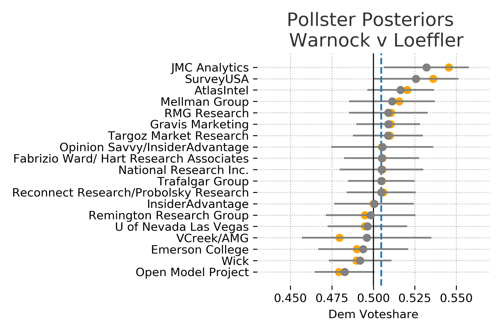

Now that the election has ended its worth evaluating how well the model did. We are interested in both the final predictions after all polls were collected and how the model changed as new data came in. 

## Final Voteshare Prediction and Results

| Candidate | Result | Mean | 80% Interval |
| ----------|--------|------|--------------|
| Ossoff    |  50.6  | 50.2 | 49.0 - 51.5  |
| Perdue    |  49.4  | 49.8 | 48.5 - 51.0  |
| Warnock   |  51.0  | 50.5 | 49.2 - 51.7  |
| Loeffler  |  49.0  | 49.5 | 48.3 - 50.8  |

The actual election results are squarely within the expected intervals with the mean prediction for Warnock-Loeffler off by 0.5% and for Ossoff-Perdue off by 0.4%. I am happy with this outcome but really this is a testament to the quality of the polling data. 

## Temporal Behavior

I am kicking myself for not including trend lines since the Democratic win probabilities experienced a big rally in the last week. Towards the end of the race almost all of the polls showed an advantage for the two Democratic candidates.  

{: .center}

{: .center}

The model makes use of all the polling data but as the election date nears the model steadily decreases the amount of uncertainty applied to the polls. The basic assumption is that there will be less time for people to be swayed to change their minds as the polls get closer to the election date. As both political parties will be trying their hardest to sway public opinion the uncertainty is symmetric. So polls closer to election day have a much bigger impact on the final output compared to early polls.

{: .center}

{: .center}

One critique of this approach would be that in the early stages the uncertainty results in voteshare distributions that are seemingly unlikely. There isn't a very good reason to expect vote shares for a candidate to be around 60% save for some rare event that would dramatically shift public opinion. There is some scientific sense to this approach, as the election gets closer there is less and less chance of some dramatic event of this type to take place. Additionally, if the uncertainty were lower for the early polls then they would have too big of an impact on the final estimated vote share distribution. 

## Learning Pollster Bias

These plots were included in the original model but its worth summarizing here again. The model assumes that the true vote share is the main factor thats driving the polls and each poll is skewed by some specific pollster effects. Meaning that each pollster is measuring the true value along with some bias. 

The model attempts to discover this true state wide voter preference by pooling the information across all of the polls. It will then adjust the pollster specific distribution based on this estimated state wide distribution. In other words, the polls regularize the estimated true voter preference, and the estimated voter preference regularizes the pollster distributions. Polls that are further out from election day or have smaller sample sizes are adjusted more aggressively. 

{: .center}

{: .center}

In these plots the record poll results are shown in orange and poll specific distributions are shown in gray. If the confidence bounds (uncertainty) is wider for a pollster then it is likely to have a bigger adjustmenet from its recorded results.

## Thoughts

Looking at vote share and win probably individually seemingly tell vastly different stories. Once the win probabilities shifted above 60% its easy to feel that the election was in the bag for the most likely candidate. The vote share distributions however make the races appear much closer. In reality it appears that very small proportional changes in public opinion can cause big swings in win probabilities. This could certainly be a factor in the frustration and confusion the general public seems to have with election forecasting. 